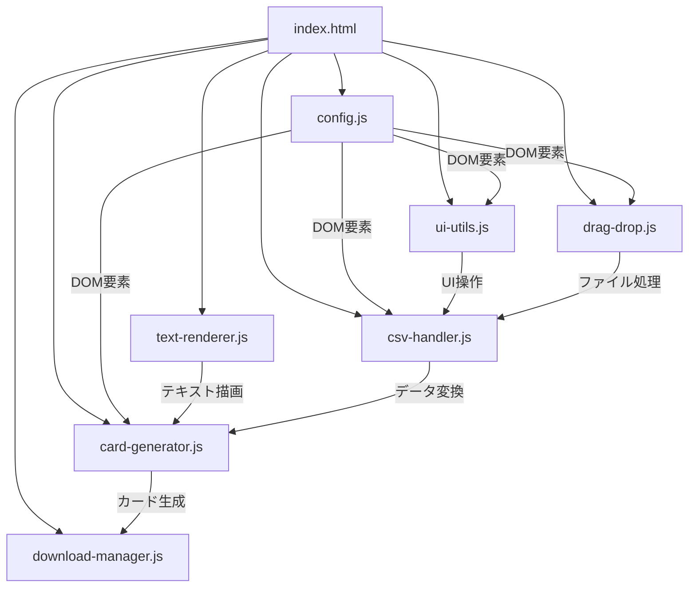

# 開発者向け技術仕様書

## 🏗️ アーキテクチャ設計

### モジュール構成



## 📋 API仕様

### config.js - 設定管理
```javascript
// DOM要素の参照（読み取り専用）
const csvInput: HTMLInputElement
const dragDropArea: HTMLElement
const cardList: HTMLElement
const downloadAllBtn: HTMLButtonElement
// ... 他のDOM要素

// グローバル変数
let cardData: Array<{title: string, text: string}>
let rawCsvData: Array<Array<string>>

// 定数
const CARD_WIDTH: number = 480
const CARD_HEIGHT: number = 720
```

### ui-utils.js - UI操作
```javascript
function clearExistingCards(): void
function resetCardData(): void
function showLoadingState(): void
function hideLoadingState(): void
function showSuccessMessage(fileName: string): void
function showResetMessage(): void
```

### text-renderer.js - テキスト描画
```javascript
function wrapTextJapaneseCentered(
    ctx: CanvasRenderingContext2D,
    text: string,
    x: number,
    y: number,
    maxWidth: number,
    lineHeight: number
): number

function wrapTextJapanese(
    ctx: CanvasRenderingContext2D,
    text: string,
    x: number,
    y: number,
    maxWidth: number,
    lineHeight: number
): void
```

### card-generator.js - カード生成
```javascript
function generateCards(data: Array<CardData>): void
function drawCard(
    ctx: CanvasRenderingContext2D,
    canvas: HTMLCanvasElement,
    card: CardData
): void

interface CardData {
    title: string;
    text: string;
}
```

### csv-handler.js - CSV処理
```javascript
function handleFileUpload(e: Event): void
function displayCsvPreview(data: Array<Array<string>>): void
function convertToCardData(): void
```

### download-manager.js - ダウンロード
```javascript
function downloadCard(canvas: HTMLCanvasElement, filename: string): void
function downloadAllCards(): void
```

### drag-drop.js - ドラッグ&ドロップ
```javascript
function initDragAndDrop(): void
function handleDragOver(e: DragEvent): void
function handleDragEnter(e: DragEvent): void
function handleDragLeave(e: DragEvent): void
function handleDrop(e: DragEvent): void
function showErrorMessage(message: string): void
```

## 🔄 データフロー詳細

### 1. CSVファイル処理
```javascript
// 入力: File オブジェクト
// 処理: Papa.parse({ header: false })
// 出力: Array<Array<string>>

Example:
[
    ["タイトル", "説明", "効果"],           // ヘッダー行
    ["火球術", "強力な火の魔法", "3ダメージ"], // データ行1
    ["氷の盾", "防御魔法", "1ダメージ軽減"]   // データ行2
]
```

### 2. データ変換
```javascript
// 入力: rawCsvData (Array<Array<string>>)
// 処理: convertToCardData()
// 出力: cardData (Array<CardData>)

Example:
[
    { title: "火球術", text: "強力な火の魔法\n3ダメージ" },
    { title: "氷の盾", text: "防御魔法\n1ダメージ軽減" }
]
```

### 3. Canvas描画
```javascript
// レイヤー構造:
1. 背景塗りつぶし (fillRect)
2. 枠線描画 (strokeRect)
3. タイトル描画 (中央揃え、自動改行)
4. 本文描画 (左揃え、自動改行)
```

## 🎨 レンダリング詳細

### フォント設定
```javascript
// タイトル
ctx.font = `bold ${titleSize.value}px "Hiragino Sans", "Meiryo", sans-serif`
ctx.textAlign = 'center'

// 本文
ctx.font = `${textSize.value}px "Hiragino Sans", "Meiryo", sans-serif`
ctx.textAlign = 'left'
```

### 座標系
```javascript
// Canvas座標系（左上原点）
const titleX = canvas.width / 2        // 中央
const titleY = 80                      // 上から80px
const textX = 30                       // 左から30px
const textY = Math.max(150, titleY + titleHeight + 30)  // 動的計算
```

### 改行アルゴリズム
```javascript
// 日本語テキスト用改行処理
1. 文字列を改行コード(\n)で分割
2. 各段落内で文字幅を測定
3. maxWidthを超える場合に改行
4. 句読点での改行は避ける
```

## 🔧 設定とカスタマイズ

### CSS カスタムプロパティ
```css
:root {
    --primary-color: #333;
    --background-color: #f5f5f5;
    --card-background: white;
    --border-radius: 8px;
}
```

### レスポンシブ設計
```css
.container {
    max-width: 1400px;
    margin: 0 auto;
    padding: 2em;
}

.card-preview {
    width: 240px;  /* プレビューサイズ */
    height: auto;  /* アスペクト比維持 */
}
```

## 🧪 テスト戦略

### 単体テスト対象
- `wrapTextJapanese()` - 改行処理
- `convertToCardData()` - データ変換
- `drawCard()` - Canvas描画

### 結合テスト対象
- CSV → プレビュー → カード生成 → ダウンロード
- デザイン設定変更 → 再描画

### ブラウザテスト
- Chrome, Firefox, Safari
- Canvas API対応確認
- ファイルAPI対応確認

## 🚀 パフォーマンス最適化

### メモリ管理
```javascript
// Canvas要素の適切な破棄
canvas.width = canvas.height = 0;
canvas = null;

// イベントリスナーのクリーンアップ
element.removeEventListener('event', handler);
```

### 描画最適化
```javascript
// オフスクリーンCanvas活用
const offscreenCanvas = new OffscreenCanvas(480, 720);
const ctx = offscreenCanvas.getContext('2d');

// バッチ処理でZIP生成
Promise.all(promises).then(results => { /* 処理 */ });
```

## 🔒 セキュリティ考慮事項

### CSVインジェクション対策
```javascript
// 数式インジェクション防止
const sanitized = text.replace(/^[=+\-@]/, "'$&");
```

### XSS対策
```javascript
// DOM操作時のエスケープ
element.textContent = userInput;  // innerHTML は使用しない
```

## 📦 依存関係管理

### 外部ライブラリ
```html
<!-- CDN使用（バージョン固定） -->
<script src="https://cdn.jsdelivr.net/npm/papaparse@5.3.2/papaparse.min.js"></script>
<script src="https://cdnjs.cloudflare.com/ajax/libs/jszip/3.10.1/jszip.min.js"></script>
<script src="https://cdnjs.cloudflare.com/ajax/libs/FileSaver.js/2.0.5/FileSaver.min.js"></script>
```

### バージョン更新手順
1. 新バージョンの動作確認
2. API変更点の調査
3. 本アプリケーションでのテスト
4. CDN URLの更新

## 🐛 エラーハンドリング

### CSV解析エラー
```javascript
Papa.parse(file, {
    error: (error) => {
        console.error('CSV解析エラー:', error);
        alert('CSVファイルの解析中にエラーが発生しました: ' + error);
        resetCardData();
    }
});
```

### Canvas描画エラー
```javascript
try {
    const ctx = canvas.getContext('2d');
    if (!ctx) throw new Error('Canvas context取得失敗');
    drawCard(ctx, canvas, card);
} catch (error) {
    console.error('描画エラー:', error);
    // フォールバック処理
}
```

## 📊 ログとデバッグ

### コンソール出力
```javascript
// CSV処理のデバッグ情報
console.log('=== CSV処理開始 ===');
console.log('全データ:', rawCsvData);
console.log('ヘッダー行:', headers);
console.log('データ行数:', dataRows.length);
```

### パフォーマンス計測
```javascript
console.time('カード生成');
generateCards(cardData);
console.timeEnd('カード生成');
```

---

**技術仕様書バージョン**: 1.0  
**最終更新**: 2025年5月29日
